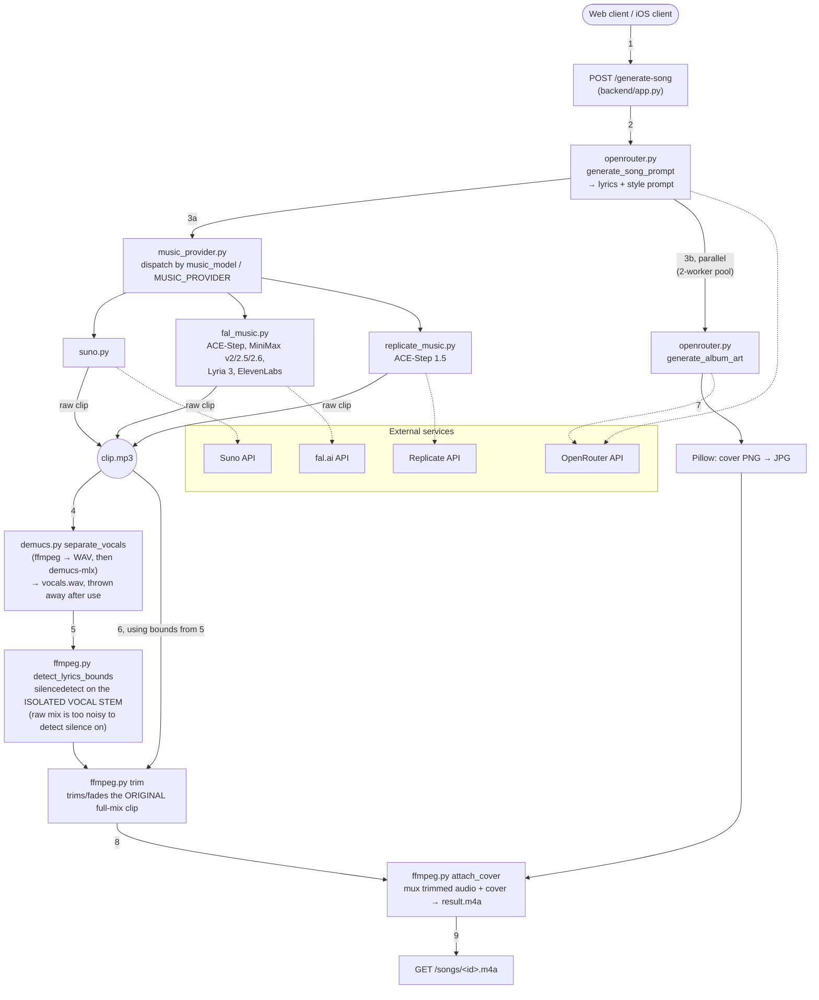
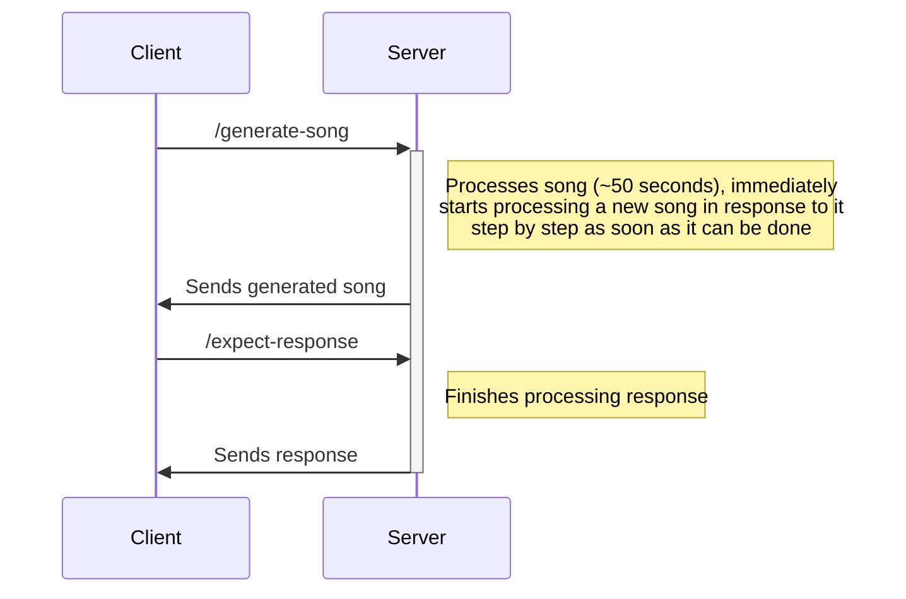

## Backend

### Operating instructions
Full local setup (Python version via `mise`, venv, demucs-mlx build, secrets) is in
[`LOCAL.md`](LOCAL.md) — start there. Quick version once secrets are in place:
```shell
cd backend
flask run --host=0.0.0.0 --port=5555 2>&1 | tee server.log
ngrok http 5555  # For public endpoint access
```
A minimal local web test client (genre pills + lyrics/music model pickers) is served at `/`
by the running backend — no separate build step, just open the URL in a browser.

### Music generation providers
Music generation is provider-agnostic via `backend/integrations/music_provider.py`, which
dispatches to whichever model is picked (in order: request's `music_model` field, the
`MUSIC_PROVIDER` env var, then Suno as the default). Currently wired up:
- **Suno** — the original integration
- **fal.ai** — ACE-Step (base + prompt-to-audio variant), MiniMax Music v2/v2.5/v2.6,
  Lyria 3, ElevenLabs Music
- **Replicate** — ACE-Step 1.5 (`fishaudio/ace-step-1.5`), the actual 1.5 release; fal.ai
  only hosts the older v1

Both the web test client and the SwiftUI iOS client let you pick lyrics model and music
model per-request. Task tracking for this area (Replicate model discovery, a
lyrics/style-mixing issue on single-prompt models, demucs/whisper → fal.ai migration) is in
`bd` (beads) — run `bd list` / `bd ready`.

### Architecture

Module-level view of `POST /generate-song`, in actual call order (not just "who imports
whom" — the numbers show the real data-dependency chain, esp. around demucs):



`backend/integrations/whisper.py` is dead code — not called anywhere in this pipeline.
Transcription-based lyric-bounds detection was superseded by the demucs+silencedetect
approach above (see Milestone 1 notes).

### Milestone 1 – Song generation
- [x] LLM integration
	- Model: z-ai/glm-5.2 (client-configurable per request; several others compared —
	  Kimi, MiniMax M3, DeepSeek V4, Grok 4.5)
	- [x] Coming up with the lyrics
	- [x] ~~(?) Finding the best slice from the transcript~~ — superseded, see below
- [x] Suno integration
	- [x] fal.ai and Replicate as alternative/additional providers, client-selectable
- [x] Stemming
- [x] ~~Transcribing~~
  - [x] Idea done: transcription (whisper) is no longer in the live pipeline —
    `backend/integrations/whisper.py` is unused now. Vocal bounds are found directly via
    ffmpeg's `silencedetect` on the demucs-separated vocal stem.
- [x] Silence scanning
  - Note: the noise threshold needed tuning (-7dB was misclassifying most actual singing
    as silence since vocal stems sit around -20 to -23dB mean volume; fixed to -30dB)
  - See the [Architecture](#architecture) diagram above for the full call order.

### Milestone 2 – Backend response
- [x] `expect-reply` client poll API taking the reference uuid — implemented
  (`/expect-reply` endpoint + `run_reply_pipeline`), but the thread that kicks it off is
  currently commented out in `app.py`'s `generate_song_endpoint`, so it's dormant rather
  than active



### Presentation
- [ ] Showcase a11y
- [ ] Mention postcards
- [ ] Mention iMessage
