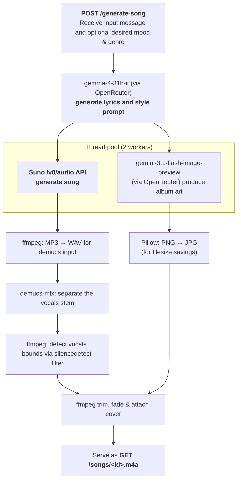
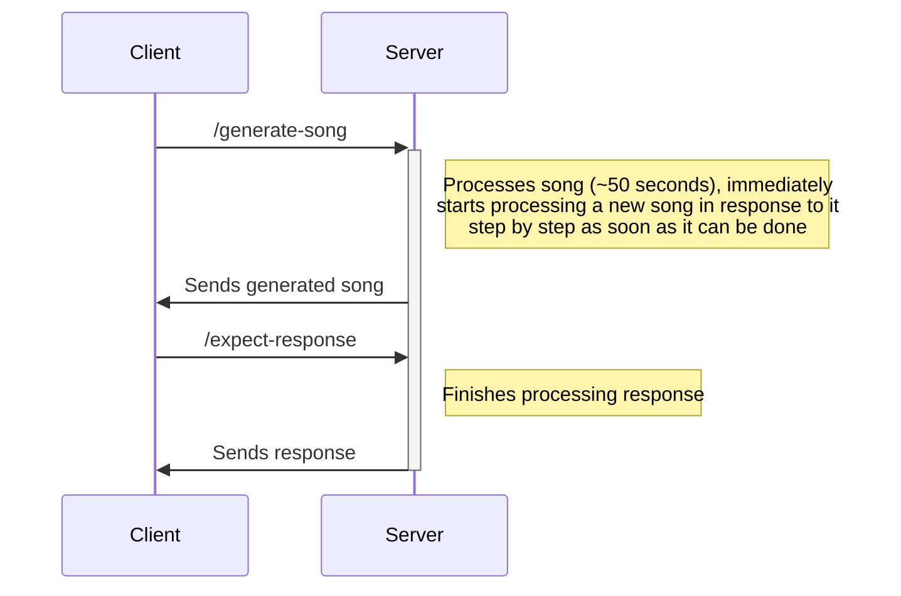

## Backend

### Operating instructions
Prep (tested on Python 3.11):
```shell
python3 -m venv venv
cd backend && pip install -r requirements.txt
cd ../demucs-mlx && make install && cd ..
```
Run:
```shell
cd backend
flask run --host=0.0.0.0 --port=5555 2>&1 | tee server.log
ngrok http 5555  # For public endpoint access
```

### Milestone 1 – Song generation
- [x] LLM integration
	- Model: Gemma-4
	- [x] Coming up with the lyrics
	- [ ] (?) Finding the best slice from the transcript
- [x] Suno integration
- [x] Stemming
- [x] Transcribing
  - [ ] Idea: try removing the transcription part and trimming to any vocals
- [x] Silence scanning



### Milestone 2 – Backend response
- [ ] `expect-response` client poll API taking the reference uuid



### Presentation
- [ ] Showcase a11y
- [ ] Mention postcards
- [ ] Mention iMessage
