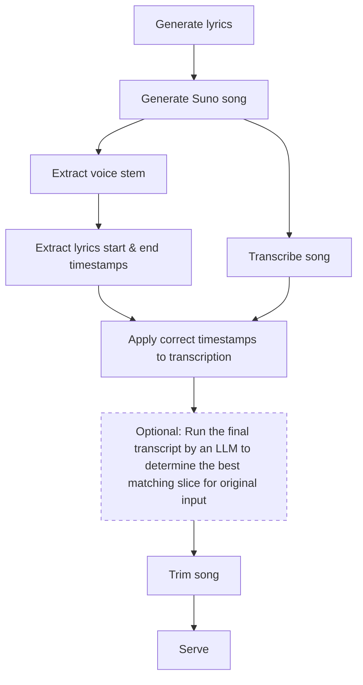

## Backend
- [ ] LLM integration
	- Gemma-4?
	- [ ] Coming up with the lyrics
	- [ ] (?) Finding the best slice from the transcript
- [ ] Stemming
- [ ] Transcribing
- [ ] Silence scanning

```mermaid
graph TD
    A[Generate lyrics] --> B[Generate Suno song]
    B --> C1[Extract voice stem]
    B --> C2[Transcribe song]
    C1 --> D1[Extract lyrics start & end timestamps]
    D1 & C2 --> E[Apply correct timestamps to transcription]
    E --> F["Optional: Run the final transcript by an LLM to determine the best matching slice for original input"]
    F --> G[Trim song]
    G --> H[Serve]

	style F stroke-dasharray: 5 5
```
